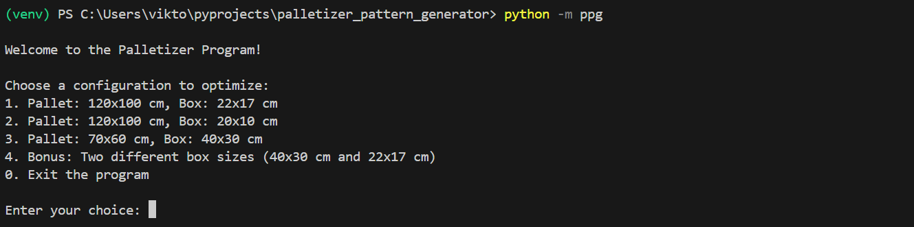

# palletizer_pattern_generator
Palletizing boxes is an important task in the logistics industry, and specifying the placing pattern of the boxes is still oftentimes done manually. Let’s change that!

This project aims to automate the process of determining the optimal arrangement of boxes on a pallet to maximize space utilization. By leveraging efficient algorithms and visualization tools, the program generates optimal packing patterns and provides insights into space utilization.

## Table of Contents
1. [About the Project](#about-the-project)
2. [Documentation](#documentation)
3. [Installation](#installation)
   - [Prerequisites](#prerequisites)
   - [Setup Instructions](#setup-instructions)
4. [Run the Project Locally](#run-the-project-locally)
5. [Usage and Examples](#usage-and-examples)
6. [Running Tests](#running-tests)
7. [License](#license)
8. [Acknowledgements](#acknowledgements)
9. [Authors and Contact](#authors-and-contact)
10. [Badges](#badges)

## About the Project
Efficiently palletizing boxes is crucial in logistics for maximizing efficiency and minimizing costs. This project provides a solution to calculate optimal 2D packing patterns for boxes on a pallet. The program considers various box dimensions and orientations to generate the best packing strategy.

### Key Features:
- **Greedy Search Algorithm**: Optimizes the placement of boxes to maximize the number of boxes that fit.
- **Support for Multiple Box Sizes**: Handles cases with one or more box types and calculates optimal placement.
- **Visualization**: Displays the packing patterns with distinct colors for different box types.
- **Reusability**: Modular design allows easy customization for different pallet and box dimensions.

## Documentation
The documentation for the project is available [here](#documentation). It includes details about the algorithms. Usage instructions, and examples can be found [here](#usage-and-examples).

## Installation
### Prerequisites
- Git (install the latest version of Git [here](https://git-scm.com/downloads))
- Python 3.8 or higher (install the latest version of Python [here](https://www.python.org/downloads/))
- pip

### Setup Instructions
For installation on your local device, open a terminal and navigate to the desired directory to clone the project from GitHub. Then perform the following steps:

1. Clone the repository from GitHub to your local device:
   ```bash
   git clone https://github.com/ViktorLaurens/palletizer_pattern_generator.git
   ```

2. Navigate to the project directory:
   ```bash
   cd palletizer_pattern_generator
   ```

3. Create a virtual environment: 
   ```bash
   python -m venv venv
   ```

4. Activate the virtual environment:
   - For Windows: 
      ```bash
      .\venv\Scripts\Activate.ps1
      ```
   - For macOS/Linux:
      ```bash
      source venv/bin/activate
      ```

5. Install dependencies: 
   ```bash
   pip install -r requirements.txt
   ```

6. Install the project in editable mode:
   ```bash
   pip install -e .
   ```

*Note: For Windows users, if you're not authorized to run scripts, enable execution by running:*
   ```bash
   Set-ExecutionPolicy -Scope CurrentUser -ExecutionPolicy RemoteSigned
   ```

## Run the Project Locally
After installation, run the project using the following command:
```bash
python -m ppg
```

## Usage and examples
When you run the command above in the terminal, you will be greeted with the following prompt:
 


The menu shows you the options you have. Entering 1, 2, 3 or 4 will calculate the optimal stacking pattern for the given pallet and box size. Each time the solution is visualized. Here are the visualizations:  

For a pallet with dimensions (W=120cm, L=100cm) and a box with size (W=22cm, L=17cm), the solution is: 


For a pallet with dimensions (W=120cm, L=100cm) and a box with size (W=20cm, L=10cm), the solution is: 


For a pallet with dimensions (W=70cm, L=60cm) and a box with size (W=40cm, L=30cm), the solution is: 


For a pallet with dimensions (W=120cm, L=100cm) and two different boxes with sizes (W=40cm, L=30cm) and (W=22cm, L=17cm), the solution when prioritizing the bigger box is: 


You are asked to choose an option again. Entering 0 will stop the program: 


## Running Tests
To run the tests in the `tests/` folder, run the following command:

```bash
pytest
```

Running pytest in the terminal should output the following: 


## License
Distributed under the [MIT](https://choosealicense.com/licenses/mit/) License. See `LICENSE` for more information.

## Acknowledgements
- [NumPy](https://numpy.org/) - A powerful library for numerical computations in Python.
- [Denavit-Hartenberg Method](https://www.researchgate.net/publication/270576179_DIFFERENCE_BETWEEN_DENAVIT_-_HARTENBERG_D-H_CLASSICAL_AND_MODIFIED_CONVENTIONS_FOR_FORWARD_KINEMATICS_OF_ROBOTS_WITH_CASE_STUDY) - The foundation for kinematic modeling in robotics.


## Authors and Contact
- Developed by [@ViktorLaurens](https://github.com/ViktorLaurens/)
- Feel free to reach out via GitHub Issues or [email](mailto:viktor@example.com).

## Badges
[](https://www.python.org/)  
[](https://choosealicense.com/licenses/mit/)